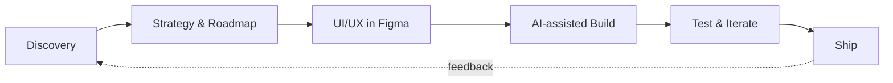

<!-- ═════════════════════════ HEADER ═════════════════════════ -->
<p align="center">
  
</p>

<p align="center">
  <a href="https://www.thegr8binil.me">
    
  </a>
</p>

<p align="center">
  <a href="https://www.thegr8binil.me"></a>
  <a href="https://twitter.com/thegr8binil"></a>
  <a href="https://github.com/thegr8binil"></a>
  
</p>

<!-- ═════════════════════════ ANALYTICS ═════════════════════════ -->
<h3 align="center">GitHub Analytics</h3>

<p align="center">
  <picture>
    <source media="(prefers-color-scheme: dark)" srcset="https://github-readme-stats.vercel.app/api?username=thegr8binil&show_icons=true&include_all_commits=true&count_private=true&hide_border=true&border_radius=12&bg_color=161b22&title_color=E3B341&text_color=C9D1D9&icon_color=E3B341&ring_color=E3B341"/>
    
  </picture>
  <picture>
    <source media="(prefers-color-scheme: dark)" srcset="https://github-readme-stats.vercel.app/api/top-langs/?username=thegr8binil&layout=compact&langs_count=6&hide_border=true&border_radius=12&bg_color=161b22&title_color=E3B341&text_color=C9D1D9"/>
    
  </picture>
</p>

<p align="center">
  <picture>
    <source media="(prefers-color-scheme: dark)" srcset="https://streak-stats.demolab.com?user=thegr8binil&hide_border=true&border_radius=12&background=161b22&ring=E3B341&fire=E3B341&currStreakNum=F0F6FC&sideNums=F0F6FC&currStreakLabel=E3B341&sideLabels=C9D1D9&dates=8B949E&stroke=30363D"/>
    
  </picture>
</p>

<details open>
<summary><b>Contribution Calendar · Achievements · Top Repos</b></summary>
<br/>
<p align="center">
  <!-- Generated daily by .github/workflows/metrics.yml -->
  
</p>
</details>

<!-- ═════════════════════════ ABOUT ═════════════════════════ -->
<h3>About Me</h3>

```ts
const binil = {
  role:       "AI Project Manager",
  superpower: "Design + Engineering in one person",
  builds:     "0 → 1 products, end to end",
  workflow:   ["Discovery", "Strategy", "UI/UX", "Code", "Ship"],
  aiTools:    ["Claude Code", "Figma Make"],
  stack:      ["React", "Next.js", "TypeScript", "Node.js"],
  basedIn:    "India — working worldwide",
  status:     "Open to freelance & full-time roles",
};
```

<!-- ═════════════════════════ STACK ═════════════════════════ -->
<h3>Tech Stack</h3>

<details open>
<summary><b>Frontend & Design</b></summary>
<br/>

<br/><sub>Framer · GSAP · React Router</sub>
</details>

<details>
<summary><b>Backend & Databases</b></summary>
<br/>

<br/><sub>tRPC · Socket.io</sub>
</details>

<details>
<summary><b>Cloud & DevOps</b></summary>
<br/>

</details>

<details>
<summary><b>Languages, Data & AI</b></summary>
<br/>

<br/><sub>Pandas · NumPy · Claude Code · Figma Make</sub>
</details>

<!-- ═════════════════════════ PROCESS ═════════════════════════ -->
<h3>How I Ship</h3>



<!-- ═════════════════════════ SNAKE ═════════════════════════ -->
<p align="center">
  <picture>
    <source media="(prefers-color-scheme: dark)" srcset="https://raw.githubusercontent.com/thegr8binil/thegr8binil/output/github-snake-dark.svg"/>
    
  </picture>
</p>

<!-- ═════════════════════════ CONTACT ═════════════════════════ -->
<p align="center">
  <b>Have a 0→1 idea or a product that needs shipping?</b><br/><br/>
  <a href="https://www.thegr8binil.me"></a>
  <a href="https://twitter.com/thegr8binil"></a>
</p>

<p align="center">
  
</p>
