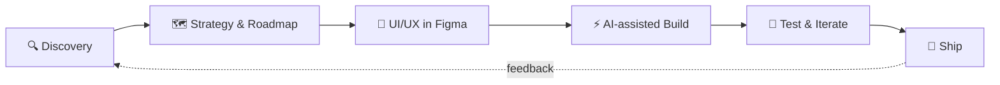

<!-- ═══════════════════════════ HEADER ═══════════════════════════ -->
<p align="center">
  
</p>

<p align="center">
  <a href="https://www.thegr8binil.me">
    
  </a>
</p>

<p align="center">
  <a href="https://www.thegr8binil.me"></a>
  <a href="https://twitter.com/thegr8binil"></a>
  <a href="https://github.com/thegr8binil"></a>
  
</p>

---

## 🧑‍🚀 About Me


```ts
const binil = {
  role:      "AI Project Manager",
  superpower:"Design + Engineering in one person",
  builds:    "0 → 1 products, end to end",
  workflow:  ["Discovery", "Strategy", "UI/UX", "Code", "Ship 🚀"],
  aiTools:   ["Claude Code", "Figma Make"],
  stack:     ["React", "Next.js", "TypeScript", "Node.js"],
  basedIn:   "India 🇮🇳 — working worldwide 🌍",
  status:    "Open to freelance & full-time roles",
};
```

<br clear="right"/>

---

## 🛠️ Tech Stack

<details open>
<summary><b>🎨 Frontend & Design</b></summary>
<br/>
<p align="left">
  
</p>
<sub>+ Framer · GSAP · React Router</sub>
</details>

<details>
<summary><b>⚙️ Backend & Databases</b></summary>
<br/>
<p align="left">
  
</p>
<sub>+ tRPC · Socket.io</sub>
</details>

<details>
<summary><b>☁️ Cloud & DevOps</b></summary>
<br/>
<p align="left">
  
</p>
</details>

<details>
<summary><b>🧠 Languages, Data & AI</b></summary>
<br/>
<p align="left">
  
</p>
<sub>+ Pandas · NumPy · Claude Code · Figma Make</sub>
</details>

> 💡 *Click each section to expand.*

---

## 📊 GitHub Analytics

<p align="center">
  
  
</p>

<details>
<summary><b>📈 Contribution Activity Graph</b></summary>
<br/>

</details>

<details>
<summary><b>🏆 GitHub Trophies</b></summary>
<br/>
<p align="center">
  
</p>
</details>

<details>
<summary><b>🔝 Top Contributed Repos</b></summary>
<br/>

</details>

---

## 🔄 How I Ship



---

## 🐍 Contribution Snake

<p align="center">
  <picture>
    <source media="(prefers-color-scheme: dark)" srcset="https://raw.githubusercontent.com/thegr8binil/thegr8binil/output/github-snake-dark.svg"/>
    <source media="(prefers-color-scheme: light)" srcset="https://raw.githubusercontent.com/thegr8binil/thegr8binil/output/github-snake.svg"/>
    
  </picture>
</p>

---

## 🤝 Let's Build Something

<p align="center">
  <b>Have a 0→1 idea, a product that needs shipping, or a role to fill?</b><br/><br/>
  <a href="https://www.thegr8binil.me">
    
  </a>
  <a href="https://twitter.com/thegr8binil">
    
  </a>
</p>

<!-- ═══════════════════════════ FOOTER ═══════════════════════════ -->
<p align="center">
  
</p>
